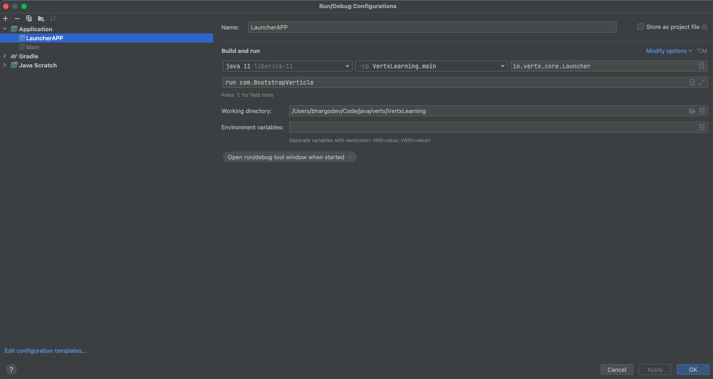

There are 2 ways to run

* **Using the Luncher class from Vertx**
* **Creating a Main class**

**Run from Launcher in vertx.**

No need for the Main class. Guice logic is put in the BootstrapVerticle mentioned as the arg for the commandline

**Main class**

Guice config is initialized from psvm and Launcher Class is used to launch the Vertx application from code

Run from command line

java -jar build/libs/VertxLearning-1.0-SNAPSHOT-all.jar run com.BootstrapVerticle

